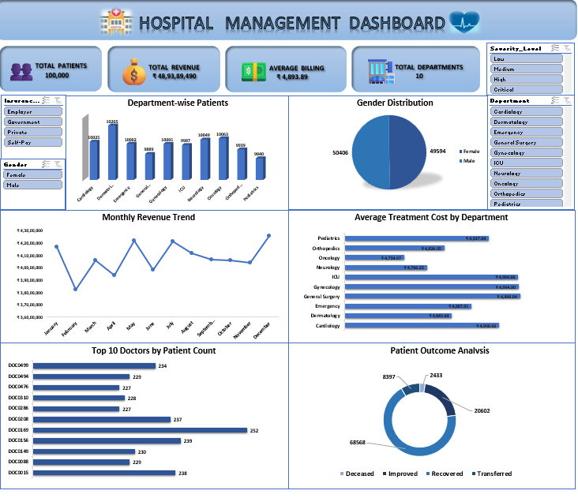

# 🏥 Hospital Management Dashboard Using Excel

## 📌 Project Overview

The **Hospital Management Dashboard** is an interactive data analytics and visualization project developed using **Microsoft Excel**. The dashboard transforms raw hospital data into meaningful insights related to patient records, admissions, discharges, departments, demographics, and hospital operations.

It provides a centralized and interactive view of key healthcare metrics, helping hospital management monitor performance and make data-driven decisions.

---

## 🎯 Objectives

- Analyze hospital and patient-related data efficiently.
- Track important healthcare Key Performance Indicators (KPIs).
- Analyze patient admission and discharge trends.
- Identify trends and patterns in hospital operations.
- Understand department-wise performance.
- Analyze patient demographic information.
- Provide an interactive reporting solution for management.
- Demonstrate practical Excel data analytics and visualization skills.

---

## 🛠️ Tools & Technologies

- **Microsoft Excel**
- **Pivot Tables**
- **Pivot Charts**
- **Excel Formulas**
- **Slicers**
- **Data Cleaning & Transformation**
- **Data Visualization**

---

## 📊 Key Features

- 📈 Interactive Hospital Management Dashboard
- 🏥 Patient Admission and Discharge Analysis
- 👨‍⚕️ Department-wise Performance Analysis
- 👥 Patient Demographic Analysis
- 📊 Key Performance Indicator (KPI) Analysis
- 📅 Date-wise and Trend Analysis
- 🔎 Interactive Filters and Slicers
- 📋 Pivot Tables and Pivot Charts
- 🎨 User-friendly and professional dashboard design

## 📸 Dashboard Preview

## 🔍 Analysis Performed

The dashboard provides insights into:

- Patient admission trends
- Patient discharge trends
- Department-wise patient distribution
- Patient demographic patterns
- Hospital performance indicators
- Date-wise operational trends
- Overall patient and hospital activity

## 💡 Project Outcome

The final dashboard provides a **centralized and interactive view of hospital data**, making it easier to monitor hospital performance, understand patient trends, analyze departments, and support data-driven decision-making.

## 📚 Skills Demonstrated

**Excel | Data Analysis | Data Visualization | Dashboard Development | Pivot Tables | Pivot Charts | Data Cleaning | Business Intelligence**

## 👩‍💻 Author

**Gayathri R**

Aspiring Data Analyst

**Skills:** Excel | SQL | Power BI | Python

